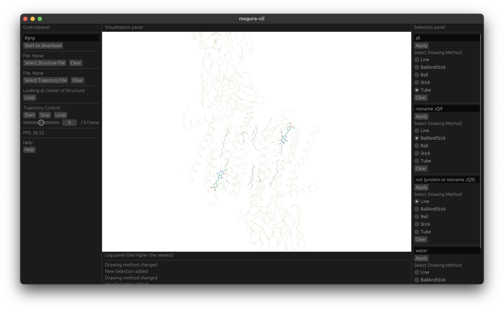
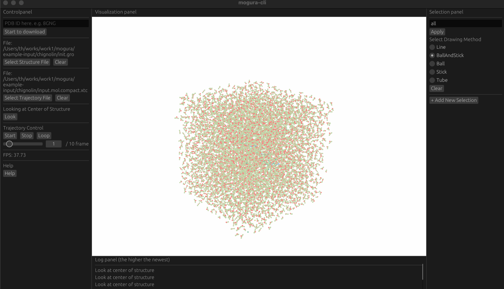

# mogura: A molecular graphic (toy) visualizer in Rust

--> [Try demo with WASM using WebGPU](https://mogura-rs.github.io/mogura/) <--

> [!WARNING]
> RAM $\geq$ 8GB, CPU $\geq$ 8cores and GPU are desirable.
>
> Do not load too large structure files.
>
> There are some limitation for WASM version.
> See [Feature](#feature)

## Quick Start
### Install
~~~bash
cargo install --git https://github.com/mogura-rs/mogura mogura --locked
~~~

### Run mogura
~~~bash
# start mogura
mogura

# show help
mogura -h

# visualize PDB: 8GNG (Or you can load them after staring mogura)
mogura 8gng.pdb

# visualize MD simulation of chignolin (Or you can load them after staring mogura)
mogura init.gro input.mol.compact.xtc
~~~

## Gallery

<table>
  <tr>
    <td></td>
    <td></td>
    <td></td>
  </tr>
  <tr>
    <td></td>
    <td></td>
    <td></td>
  </tr>
</table>

Input files are available [here](https://github.com/mogura-rs/example-inputs)

## Feature
- Visualize PDB, GRO format
  - stick, stick&ball, ball, tube(catmull-rom), line mode are supported
  - WASM does not support line (because WebGPU)
- Visualize MD simulation using XTC format
  - topology must be PDB or GRO format
  - WASM does not support this (because of groan_rs, this crate depends internally on libc)
- Atom selection language
  - `resname, resid, name, index, protein, water, backbone, sidechain, ion, all, (), and, or, not` are reserved words
  - support complex syntax
    - e.g. `protein and name C CA N`, `(resname TYR PRO) and protein or not water`
- Multiple selection panel
  - multiple atom selection are possible for a single structure file.
- Fetch PDB
  - dirty pdb file will cause parse error because of pdbtbx.

## TODO
- [ ] Lv1: Change configuration of selected atoms (e.g. Color, Radius, Opacity)
- [ ] Lv1: Load multiple structure files
- [ ] Lv1: Morphing by specifying two structures
- [ ] Lv2: Pick up atoms and highlight them with their name
- [ ] Lv2: Allow more flexible configuration of plugins
- [ ] Lv3: Secondary structure prediction using DSSP or STRIDE
- [ ] Lv3: Visualize structure as Cartoon and NewCartoon
- [ ] Lv4: Path tracing using [bevy-hikari](https://github.com/cryscan/bevy-hikari)(but no more developed) or [developing default feature](https://github.com/bevyengine/bevy/issues/639)

## About the name

$$
\text{Molecular Graphic Visualizer} \rightarrow \text{Mole + graphic} \rightarrow \text{Mo + gra} \rightarrow \text{mogura}
$$

mogura also means "Mole".

## Useful Reference

 References 

- [bevy](https://github.com/bevyengine/bevy)
  - https://bevy-cheatbook.github.io/
  - https://github.com/qu1x/bevy_trackball
  - https://github.com/bytestring-net/bevy_lunex
- graphics
  - https://github.com/RayTracing
    - https://github.com/RayTracing/gpu-tracing
    - https://github.com/RayTracing/raytracing.github.io
  - https://github.com/NotCamelCase/RasterizationInOneWeekend
  - https://github.com/svenstaro/bvh
  - https://github.com/pannapudi/voidin
  - https://github.com/BLaZeKiLL/webray
  - https://github.com/servo/pathfinder
- [egui](https://github.com/emilk/egui)
  - https://github.com/vladbat00/bevy_egui
- [wgpu](https://github.com/gfx-rs/wgpu)
  - https://sotrh.github.io/learn-wgpu/
  - https://github.com/jack1232/wgpu-step-by-step
  - https://github.com/jinleili/simuverse
- pdb, gro, xtc
  - https://github.com/douweschulte/pdbtbx
  - https://github.com/Ladme/groan_rs
- other great visualizer
  - [PyMol](https://github.com/schrodinger/pymol-open-source)
  - [VMD](https://www.ks.uiuc.edu/Research/vmd/)
  - [ChimeraX](https://github.com/RBVI/ChimeraX)
  - [molstar](https://github.com/molstar/molstar)
    - [VSCoding-Sequence](https://github.com/molstar/VSCoding-Sequence)
  - [Cuemol](https://github.com/CueMol/cuemol2)
  - [ngl](https://github.com/nglviewer/ngl)
- other visualizer in Rust
  - [ferricyanide](https://github.com/frodofine/ferricyanide)

